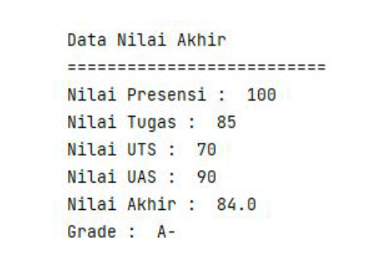

# Program Perhitungan Nilai Akhir dan Grade

Program ini digunakan untuk menghitung nilai akhir dan menentukan grade berdasarkan nilai presensi, tugas, Ujian Tengah Semester (UTS), dan Ujian Akhir Semester (UAS) dengan bobot tertentu. Program ini juga mengelompokkan nilai akhir ke dalam grade sesuai dengan ketentuan yang diberikan.

## Daftar Isi
- [Deskripsi](#deskripsi)
- [Perhitungan Grade](#perhitungan-grade)
- [Fitur](#fitur)
- [Contoh Output](#contoh-output)
  

## Deskripsi

Program ini menerima input berupa nilai presensi, nilai tugas, nilai UTS, dan nilai UAS. Nilai akhir dihitung berdasarkan bobot masing-masing, dan kemudian program akan mengelompokkan nilai akhir tersebut ke dalam grade yang sesuai.

Bobot nilai adalah sebagai berikut:
- **Nilai Presensi**: 10%
- **Nilai Tugas**: 20%
- **Nilai UTS**: 30%
- **Nilai UAS**: 40%

## Perhitungan Grade
Rumus perhitungan nilai akhir:
Nilai Akhir = (10% * nilai presensi) + (20% * nilai tugas) + (30% * nilai UTS) + (40% * nilai UAS)

## Fitur

- Menghitung nilai akhir berdasarkan bobot yang ditentukan.
- Menampilkan nilai akhir beserta grade yang sesuai.

## Contoh Output
 Berikut adalah contoh output program setelah dijalankan:

